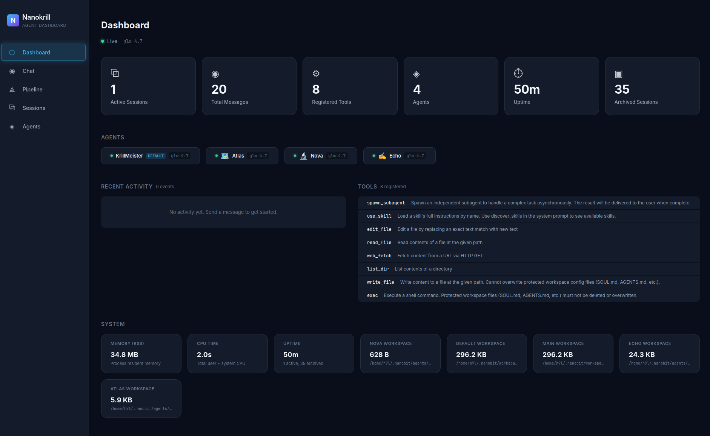
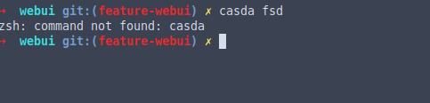
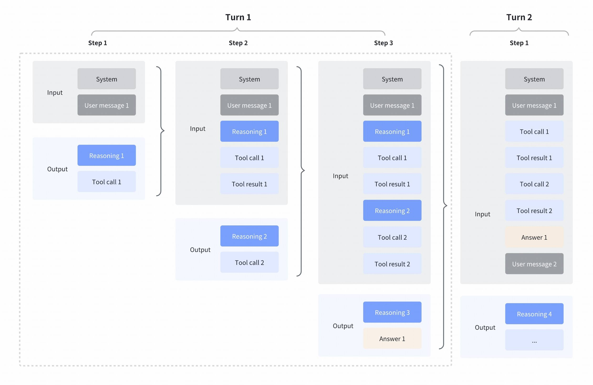
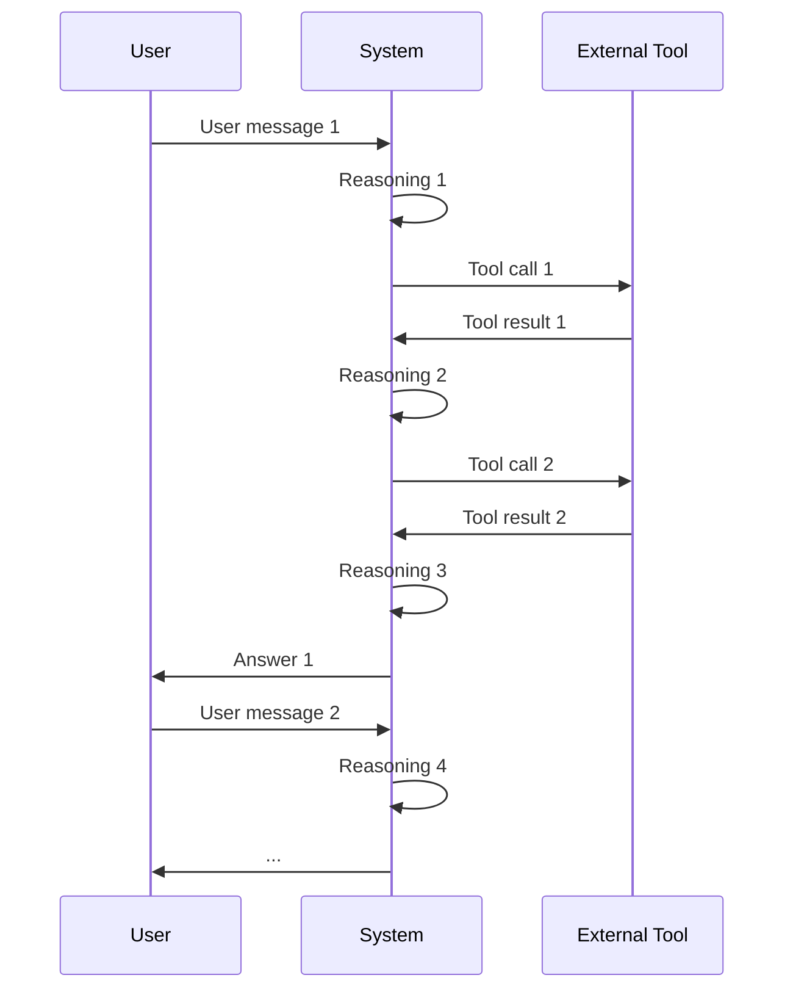
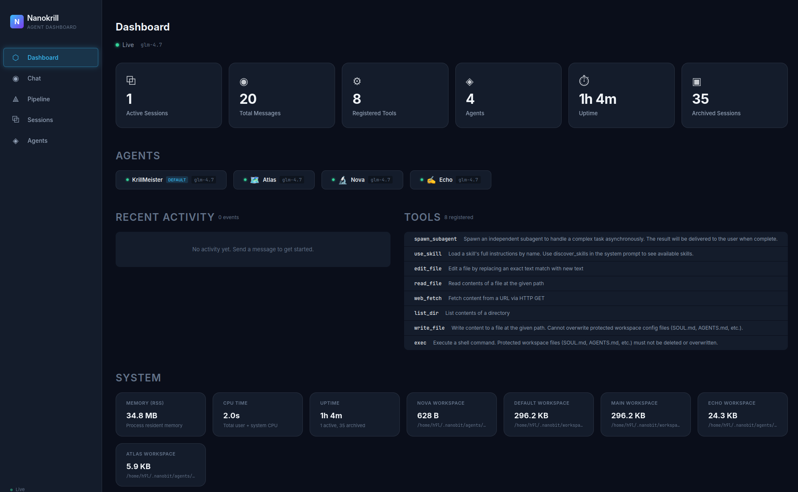

# glm-vision — Example Results

All results generated with **model: glm-4.6v** via the Z.AI Coding Plan endpoint.

## Summary

| Tool | Duration | Prompt Tokens | Completion Tokens | Reasoning Tokens | Total Tokens | Response |
|------|----------|--------------|-------------------|------------------|--------------|----------|
| `analyze_image` | 31.0s | 1,080 | 562 | 61 | 1,642 | [json](responses/20260213_125911_analyze_image.json) |
| `extract_text` | 62.1s | 4,034 | 1,270 | 649 | 5,304 | [json](responses/20260213_130013_extract_text.json) |
| `diagnose_error` | 51.3s | 1,652 | 1,006 | 315 | 2,658 | [json](responses/20260213_130104_diagnose_error.json) |
| `understand_diagram` | 61.0s | 6,367 | 3,591 | 1,933 | 9,958 | [json](responses/20260213_130205_understand_diagram.json) |
| `analyze_data_viz` | 84.5s | 3,784 | 1,779 | 745 | 5,563 | [json](responses/20260213_130330_analyze_data_viz.json) |
| `ui_diff_check` | 123.5s | 6,629 | 2,142 | 1,483 | 8,771 | [json](responses/20260213_130533_ui_diff_check.json) |
| `ui_to_artifact (code)` | 203.0s | 3,195 | 4,281 | 242 | 7,476 | [json](responses/20260213_151155_ui_to_artifact_code.json) |
| `ui_to_artifact (prompt)` | 59.0s | 2,979 | 1,262 | 253 | 4,241 | [json](responses/20260213_151254_ui_to_artifact_prompt.json) |
| `ui_to_artifact (spec)` | 42.8s | 2,949 | 1,913 | 281 | 4,862 | [json](responses/20260213_151337_ui_to_artifact_spec.json) |
| `ui_to_artifact (description)` | 43.3s | 2,961 | 2,197 | 743 | 5,158 | [json](responses/20260213_130618_ui_to_artifact.json) |
| `analyze_video` | 53.1s | 22,853 | 568 | 432 | 23,421 | [json](responses/20260213_130711_analyze_video.json) |

---

## 1. analyze_image

> General-purpose image analysis using `GENERAL_IMAGE_ANALYSIS` prompt.

Full JSON response: [responses/20260213_125911_analyze_image.json](responses/20260213_125911_analyze_image.json)

**Input:** `flowers.jpg`


**Output:**
````

**Main Response**

The image depicts a vibrant field of bright yellow flowers, likely California poppies, set against a clear, vivid blue sky. The flowers are in sharp focus in the foreground, creating a sense of depth, while the background is softly blurred, emphasizing the subject and giving the scene a dreamy, natural quality. The overall impression is one of a sunny, cheerful day in a wildflower meadow.

**Detailed Observations**

*   **Flowers:** The dominant subject is a dense cluster of bright yellow flowers. These appear to be California poppies (Eschscholzia californica), identifiable by their characteristic cup-shaped blooms with four petals. The flowers are at various stages of bloom, with some fully open and others still in bud form. Their vibrant yellow petals contrast sharply with the green stems and leaves.
*   **Sky:** The background is a clear, intense blue sky, suggesting a sunny day with minimal cloud cover. The blue is a deep, saturated shade, enhancing the brightness of the yellow flowers.
*   **Composition and Focus:** The image uses a shallow depth of field, with the flowers in the foreground in sharp focus and the background elements, including some out-of-focus white flowers and green stems, blurred. This technique draws the viewer's eye directly to the yellow blooms and creates a sense of depth and atmosphere.
*   **Color Palette:** The primary colors are a striking combination of bright yellow and deep blue, creating a visually appealing and cheerful contrast. The green of the stems and leaves provides a natural, complementary accent.
*   **Lighting:** The lighting appears to be natural sunlight, casting a warm glow on the flowers and contributing to their vivid colors. The bright, even lighting suggests it is midday or early afternoon.

**Context & Analysis**

This image likely captures a scene from a wildflower super bloom, a phenomenon where an unusually high proportion of wildflowers bloom simultaneously, often occurring in regions like California after heavy rainfall. The composition and color choices evoke feelings of happiness, warmth, and the beauty of nature. The shallow depth of field is a common photographic technique used to isolate the subject and create an aesthetically pleasing image, often seen in landscape and nature photography.

**Additional Notes**

The blurred background elements, including what appear to be smaller white flowers, add to the sense of a rich, diverse natural environment without distracting from the main subject. The overall mood of the image is peaceful and uplifting.
````

---

## 2. extract_text

> Extract text and code from screenshots using `TEXT_EXTRACTION` prompt.

Full JSON response: [responses/20260213_130013_extract_text.json](responses/20260213_130013_extract_text.json)

**Input:** `screenshot.png`



**Output:**
````

## Extracted Text

```markdown
NANOBI
AI Agent Automation

Dashboard
Chat
Pipeline
Sessions
Agents

Dashboard
Live glm-4.7

1
Active Sessions

20
Total Messages

8
Registered Tools

4
Agents

50m
Uptime

35
Archived Sessions

AGENTS
KrillMeister DEFAULT glm-4.7
Atlas glm-4.7
Nova glm-4.7
Echo glm-4.7

RECENT ACTIVITY 0 events
No activity yet. Send a message to get started.

TOOLS 8 registered
spawn_subagent Spawn an independent subagent to handle a complex task asynchronously. The result will be delivered to the user when complete.
use_skill Load a skill's full instructions by name. Use discover_skills in the system prompt to see available skills.
edit_file Edit a file by replacing an exact text match with new text
read_file Read contents of a file at the given path
web_fetch Fetch content from a URL via HTTP GET
list_dir List contents of a directory
write_file Write content to a file at the given path. Cannot overwrite protected workspace config files (SOUL.md, AGENTS.md, etc.).
exec Execute a shell command. Protected workspace files (SOUL.md, AGENTS.md, etc.) must not be deleted or overwritten.

SYSTEM
MEMORY (RSS)
34.8 MB
Process resident memory

CPU TIME
2.0s
Total user + system CPU

UPTIME
50m
1 active, 35 archived

NOVA WORKSPACE
628 B
/home/h9L/.nanobit/agents/...

DEFAULT WORKSPACE
296.2 KB
/home/h9L/.nanobit/workspace...

MAIN WORKSPACE
296.2 KB
/home/h9L/.nanobit/workspace...

ECHO WORKSPACE
24.3 KB
/home/h9L/.nanobit/agents/...

ATLAS WORKSPACE
5.9 KB
/home/h9L/.nanobit/agents/...
```

## Content Type
Dashboard interface for an AI agent automation platform showing system statistics, agent status, recent activity, available tools, and system resource information.

## Language/Format
Web dashboard interface with structured sections and statistics display.

## OCR Corrections
- No significant OCR corrections needed as the text was clearly legible in the screenshot.
- Preserved the exact spacing and layout as shown in the interface.

## Quality Notes
- The text appears to be from a dark-themed dashboard interface with good contrast.
- All text elements are clearly visible and complete in the screenshot.
- The layout includes a sidebar navigation, main dashboard area with statistics cards, and multiple sections (Agents, Recent Activity, Tools, System).
- The interface shows a live status indicator with "glm-4.7" model version.
- System paths are visible in the workspace sections showing file system locations.
- The layout maintains proper hierarchical structure with section headers and corresponding content.
````

---

## 3. diagnose_error

> Diagnose errors with root cause analysis using `ERROR_DIAGNOSIS` prompt.

Full JSON response: [responses/20260213_130104_diagnose_error.json](responses/20260213_130104_diagnose_error.json)

**Input:** `error.png`



**Output:**
````

## Error Summary

A **"command not found" error** occurred in the Zsh shell. The terminal shows that when attempting to run the command `casda fsd`, the shell couldn't locate an executable named `casda` in the system's PATH. This is a common shell error indicating that the specified command doesn't exist or isn't accessible from the current environment.

## Root Cause Analysis

The error occurred because:
- The command `casda` is not installed on your system, or
- The command exists but isn't in your shell's PATH environment variable, or  
- There's a typo in the command name

This is happening in a Zsh shell (visible from the prompt format), likely in a development environment given the git repository context (`webui git:(feature-webui)`). The command appears to be a custom or third-party tool that hasn't been properly installed or configured.

## Solution

### Immediate Fix
1. **Check for typos**: Verify the correct spelling of the command. If it should be `casda`, ensure you're typing it correctly.
2. **Install the command**: If `casda` is a legitimate tool, install it using your package manager:
   ```bash
   # For Homebrew (macOS)
   brew install casda
   
   # For npm
   npm install -g casda
   
   # For Python pip
   pip install casda
   ```

3. **Check PATH**: If the command is installed but not found, add its location to your PATH:
   ```bash
   # Find where casda is installed
   which casda
   
   # Add to PATH (temporary)
   export PATH="$PATH:/path/to/casda"
   
   # Or add permanently to your .zshrc
   echo 'export PATH="$PATH:/path/to/casda"' >> ~/.zshrc
   ```

### Alternative Approaches
- **Use full path**: If you know the exact location, run it directly:
  ```bash
  /full/path/to/casda fsd
  ```

- **Check aliases**: The command might be aliased to something else:
  ```bash
  alias casda
  ```

## Prevention

To avoid similar issues:
1. **Verify command existence**: Always check if a command exists before trying to run it:
   ```bash
   command -v casda >/dev/null 2>&1 || echo "casda not found"
   ```

2. **Use package managers**: Install development tools through proper package managers rather than manual installation.

3. **Document dependencies**: Keep track of required tools in your project documentation or README.

4. **Use version managers**: For language-specific tools, use version managers (nvm, rbenv, etc.) to ensure consistent environments.

## Additional Notes

The error occurred in what appears to be a web development project (based on the "webui" repository name). If `casda` is a development tool specific to this project, check:
- The project's `package.json` or similar dependency files
- Any installation scripts or setup instructions
- Whether the tool should be installed locally (npm install) or globally

If this is a custom script, ensure it has the executable permission:
```bash
chmod +x /path/to/casda
```
````

---

## 4. understand_diagram

> Analyze technical diagrams using `DIAGRAM_UNDERSTANDING` prompt.

Full JSON response: [responses/20260213_130205_understand_diagram.json](responses/20260213_130205_understand_diagram.json)

**Input:** `diagram.jpg`



**Output:**
````

### Diagram Overview  
This is a **sequence/interaction diagram** illustrating a **multi-turn conversational workflow** for an AI system (e.g., a tool-augmented language model or agent). It depicts how the system processes user input, performs reasoning, interacts with external tools, and generates responses across multiple "turns" (conversational exchanges). The diagram uses a **box-and-arrow notation** with color-coded components to distinguish between:  
- **Input**: Gray boxes (e.g., "System," "User message") representing data provided to the system.  
- **Output**: Colored boxes (blue for "Reasoning," light blue for "Tool call"/"Tool result," beige for "Answer") representing the system’s internal processes or external interactions.  

The scope is high-level, focusing on the **flow of information** between the user, the system, and external tools, rather than internal implementation details of individual components.


### Components  
The diagram includes six core components, each with a distinct role:  

| Component       | Role                                                                 | Example in Diagram                          |  
|-----------------|----------------------------------------------------------------------|---------------------------------------------|  
| **System**      | The AI agent or conversational engine that processes inputs and generates outputs. | Appears in every "Input" box as a gray box.   |  
| **User message**| Input from the user (e.g., a question or command) that initiates or continues a turn. | "User message 1" (Turn 1) and "User message 2" (Turn 2). |  
| **Reasoning**   | The system’s internal thought process (e.g., planning, reflection, or decision-making). | "Reasoning 1," "Reasoning 2," "Reasoning 3," "Reasoning 4" (colored blue). |  
| **Tool call**   | A request from the system to an external tool (e.g., API, database, calculator). | "Tool call 1," "Tool call 2" (light blue).    |  
| **Tool result** | The output from the external tool in response to a "Tool call."           | "Tool result 1," "Tool result 2" (light blue).|  
| **Answer**      | The final response from the system to the user (e.g., a resolved query or action). | "Answer 1" (beige).                         |  


### Relationships & Data Flow  
The diagram traces a **iterative, stateful workflow** where each turn builds on context from previous steps. Here’s a step-by-step breakdown:  

#### Turn 1 (3 Steps)  
1. **Step 1**:  
   - **Input**: The user sends "User message 1" to the "System."  
   - **Output**: The system processes the message and generates:  
     - "Reasoning 1" (internal thought: e.g., "I need to check the user’s order status").  
     - "Tool call 1" (request to an external tool: e.g., "Query the OrdersDB for user ID 123").  

2. **Step 2**:  
   - **Input**: The system retains "User message 1," "Reasoning 1," and "Tool call 1" (context from Step 1).  
   - **Output**: The system refines its reasoning and generates:  
     - "Reasoning 2" (e.g., "I need to verify the user’s shipping address").  
     - "Tool call 2" (e.g., "Query the UsersDB for address of user ID 123").  

3. **Step 3**:  
   - **Input**: The system includes all prior context ("User message 1," "Reasoning 1," "Tool call 1," "Tool result 1" [from Step 2’s tool call], "Reasoning 2," "Tool call 2").  
   - **Output**: The system uses tool results to finalize reasoning and generate:  
     - "Reasoning 3" (e.g., "The order is shipped; address is correct").  
     - "Answer 1" (final response: e.g., "Your order #456 is on its way to 123 Main St.").  

#### Turn 2 (1 Step Shown)  
- **Step 1**:  
  - **Input**: The system retains all context from Turn 1 ("User message 1," "Tool call 1," "Tool result 1," "Tool call 2," "Tool result 2," "Answer 1") plus a new "User message 2" (e.g., "Can you track my package?").  
  - **Output**: The system starts a new reasoning cycle ("Reasoning 4") and indicates ongoing processing ("...").  


### Architecture Analysis  
#### Design Patterns & Principles  
The diagram embodies a **tool-augmented reasoning pattern** (similar to frameworks like ReAct or Toolformer), where:  
- **Separation of Concerns**: The system separates "reasoning" (internal logic) from "tool interaction" (external actions), enabling modularity (e.g., swapping tools without changing reasoning logic).  
- **Stateful Context**: Each turn retains context from prior steps (user messages, tool calls, results), allowing the system to handle complex, multi-step queries.  
- **Iterative Refinement**: The system refines its reasoning and tool calls across steps, using tool results to improve accuracy (e.g., "Tool result 1" informs "Reasoning 2").  

#### Strengths  
- **Transparency**: The flow of reasoning and tool usage is explicit, making it easier to debug or explain the system’s decisions.  
- **Flexibility**: The modular design supports adding new tools or modifying reasoning logic without rewriting the entire system.  
- **Scalability**: The stateful approach allows the system to handle long, multi-turn conversations (e.g., customer support chats).  

#### Potential Concerns  
- **State Management**: If the system fails to retain context (e.g., due to session timeouts or bugs), it may lose track of prior tool results or reasoning, leading to incorrect answers.  
- **Complexity**: The number of steps per turn can grow with query complexity, increasing the risk of "context overflow" (e.g., too many prior messages/tool results to process).  
- **Tool Latency**: External tool calls (e.g., database queries) can introduce delays, impacting user experience if not optimized.  


### Textual Representation (Mermaid Sequence Diagram)  
To make the flow concrete, here’s a simplified Mermaid diagram representing the core interactions:  




### Key Takeaways  
This diagram illustrates a **structured, iterative AI workflow** where the system balances internal reasoning with external tool usage to solve complex problems. The design prioritizes clarity (via explicit reasoning steps) and flexibility (via modular tool integration) but requires careful state management to avoid context loss. For implementation, this would likely map to a system using a large language model (LLM) with tool-calling capabilities, a state store (e.g., database or in-memory cache) to retain context, and external APIs/tools for data retrieval.
````

---

## 5. analyze_data_viz

> Analyze charts, graphs, and dashboards using `DATA_VIZ_ANALYSIS` prompt.

Full JSON response: [responses/20260213_130330_analyze_data_viz.json](responses/20260213_130330_analyze_data_viz.json)

**Input:** `screenshot.png`


**Output:**
````

### Visualization Summary  
This is a **real-time system dashboard** for the "Nanobit Studio" platform, displaying metrics related to user activity, agent status, tool registration, system performance, and workspace usage. The dashboard is live (indicated by the "Live" status) and focuses on the current state of the system, with an uptime of 50 minutes (suggesting the system has been running for a short duration or was recently restarted). Data sources are not explicitly labeled but likely include internal system logs, agent telemetry, and user session data.  


### Key Metrics  
The dashboard highlights the following core metrics:  
- **User/Session Metrics**:  
  - Active Sessions: 1 (current live sessions)  
  - Total Messages: 20 (cumulative messages exchanged)  
  - Archived Sessions: 35 (historical sessions)  
- **Agent/Tool Metrics**:  
  - Registered Tools: 8 (available tools for agents)  
  - Agents: 4 (active agents, all running version `g1m-4.7`)  
- **System Performance**:  
  - Uptime: 50m (system has been running for 50 minutes)  
  - Memory (RSS): 34.8 MB (process resident memory, indicating low resource usage)  
  - CPU Time: 2.0s (total user + system CPU time, minimal load)  
- **Workspace Metrics**:  
  - Nova Workspace: 628 B (smallest workspace, likely new or minimal)  
  - Default/Main Workspaces: 296.2 KB (largest workspaces, consistent in size)  
  - Echo Workspace: 24.3 KB  
  - Atlas Workspace: 5.9 KB  


### Trends & Patterns  
1. **Low User Engagement**:  
   - Active sessions (1) are drastically lower than archived sessions (35), suggesting most user interactions are short-lived or completed.  
   - Total messages (20) are minimal, indicating limited user activity or a lack of ongoing conversations.  
2. **Consistent Agent/Tool Setup**:  
   - All 4 agents run the same version (`g1m-4.7`), ensuring uniformity in functionality.  
   - 8 registered tools (e.g., `spawn_subagent`, `edit_file`, `web_fetch`) provide a standardized set of capabilities.  
3. **Lightweight System Performance**:  
   - Memory usage (34.8 MB) and CPU time (2.0s) are extremely low, indicating the system is resource-efficient.  
   - Uptime (50m) suggests the system is either new or was recently restarted, with no signs of instability yet.  
4. **Workspace Usage**:  
   - Default and Main workspaces are the largest (296.2 KB), possibly due to frequent use or pre-configured data.  
   - Nova workspace is the smallest (628 B), hinting at a new or unused workspace.  


### Anomalies & Insights  
- **Low Active Sessions vs. Archived Sessions**: The 35 archived sessions vs. 1 active session suggests most users close or archive sessions quickly. This could indicate:  
  - Sessions are short (e.g., task completion) or users abandon them.  
  - A lack of ongoing user engagement (e.g., no follow-up interactions).  
- **Zero Recent Activity**: The "Recent Activity" section shows 0 events, meaning no user actions (e.g., messages, tool usage) have occurred recently. This aligns with low active sessions and total messages.  
- **Uniform Agent Versions**: All agents share the same version, which is positive for consistency but may require monitoring for updates (e.g., security patches).  


### Actionable Recommendations  
1. **Investigate User Engagement**:  
   - Analyze why active sessions are low: Check if the system is accessible, if features meet user needs, or if there’s a lack of awareness. Consider running user surveys or A/B testing to improve engagement.  
2. **Monitor Session Lifecycle**:  
   - Track why sessions are archived (e.g., task completion vs. abandonment). If abandonment is high, optimize onboarding or provide clearer guidance.  
3. **Validate System Stability**:  
   - Since uptime is only 50m, monitor for crashes or errors over time. The low resource usage is positive, but long-term stability should be verified.  
4. **Optimize Workspace Usage**:  
   - Review the Nova workspace (628 B) to determine if it’s unused or underutilized. If so, consider deleting or repurposing it to free up storage.  
5. **Plan for Agent Updates**:  
   - While all agents are on the same version, schedule regular checks for updates to ensure security and feature parity.  


This analysis highlights that the system is currently lightweight and stable but lacks active user engagement. Prioritizing user experience and monitoring long-term stability will help maximize the platform’s value.
````

---

## 6. ui_diff_check

> Compare two UI screenshots for visual regression using `UI_DIFF_CHECK` prompt.

Full JSON response: [responses/20260213_130533_ui_diff_check.json](responses/20260213_130533_ui_diff_check.json)

**Input:** `screenshot.png` (expected) vs `screenshot-diff.png` (actual)

| Expected | Actual |
|----------|--------|
|  |  |

**Output:**
````

## Overall Assessment  
The two screenshots are highly similar, with only minor discrepancies. The primary differences involve incorrect uptime values in two sections and an extra "Live" indicator at the bottom left. These issues are mostly content-related, with no major structural or styling deviations.

---

## Detailed Differences  

### 1. Dashboard - Uptime Card  
- **Location**: Top row of dashboard cards (fifth card from left)  
- **Issue Description**: Incorrect uptime value displayed  
- **Expected vs. Actual**:  
  - Expected: `50m`  
  - Actual: `1h 4m`  
- **Severity**: HIGH (Incorrect system status information could mislead users)  

### 2. SYSTEM Section - Uptime Card  
- **Location**: Third card in the SYSTEM section (labeled "UPTIME")  
- **Issue Description**: Incorrect uptime value displayed  
- **Expected vs. Actual**:  
  - Expected: `50m`  
  - Actual: `1h 4m`  
- **Severity**: HIGH (Consistent with the dashboard card, this reinforces the incorrect status)  

### 3. Bottom Left Corner (Outside Sidebar)  
- **Location**: Bottom left of the screen (below the sidebar)  
- **Issue Description**: Extra "Live" indicator (not present in the expected design)  
- **Expected vs. Actual**:  
  - Expected: No element  
  - Actual: "Live" text with a green dot  
- **Severity**: LOW (Minor UI clutter; likely a leftover debug element)  

---

## Layout Issues  
No structural or positioning discrepancies were found. All elements align correctly, and spacing between components is consistent.  

---

## Content Issues  
- **Uptime Values**: Both the dashboard and SYSTEM sections display incorrect uptime (`1h 4m` instead of `50m`). This is a content accuracy issue.  
- **Extra "Live" Indicator**: An unintended "Live" element is present at the bottom left, which is not part of the expected design.  

---

## Styling Issues  
No visual styling differences (colors, fonts, borders, shadows) were identified. All elements match in terms of typography, color scheme, and visual treatment.  

---

## Recommended Fixes  
1. **Correct Uptime Values**:  
   - Update the uptime value in the dashboard’s Uptime card to `50m`.  
   - Update the uptime value in the SYSTEM section’s Uptime card to `50m`.  
   - **Priority**: HIGH (Fix first to ensure accurate system status display).  

2. **Remove Extra "Live" Indicator**:  
   - Locate and remove the unintended "Live" element at the bottom left of the screen.  
   - **Priority**: LOW (Fix after addressing critical content issues).  

---

## Testing Notes  
- Verify that the uptime values are dynamically calculated correctly (e.g., from a backend API) to prevent future discrepancies.  
- Check for any residual debug elements (like the "Live" indicator) that may have been accidentally left in the production build.  
- Confirm that all content (text, numbers) is pulled from the correct data sources to ensure consistency across the interface.
````

---

## 7. ui_to_artifact (code)

> Convert UI screenshot to HTML/CSS using `UI_TO_ARTIFACT_CODE` prompt (default).

Full JSON response: [responses/20260213_151155_ui_to_artifact_code.json](responses/20260213_151155_ui_to_artifact_code.json)

**Input:** `screenshot.png`


**Output:**
````

## Generated Code

```html
<!DOCTYPE html>
<html lang="en">
<head>
    <meta charset="UTF-8">
    <meta name="viewport" content="width=device-width, initial-scale=1.0">
    <title>NanoBit Dashboard</title>
    <link rel="stylesheet" href="https://cdnjs.cloudflare.com/ajax/libs/font-awesome/5.15.3/css/all.min.css">
    <style>
        :root {
            --bg-primary: #1a1f2e;
            --bg-secondary: #232836;
            --bg-card: #2a3142;
            --text-primary: #e2e8f0;
            --text-secondary: #a0aec0;
            --accent-blue: #3b82f6;
            --accent-green: #10b981;
            --border-radius: 8px;
            --spacing: 16px;
        }

        * {
            margin: 0;
            padding: 0;
            box-sizing: border-box;
        }

        body {
            font-family: 'Inter', -apple-system, BlinkMacSystemFont, 'Segoe UI', Roboto, sans-serif;
            background-color: var(--bg-primary);
            color: var(--text-primary);
            line-height: 1.5;
        }

        .container {
            display: flex;
            min-height: 100vh;
        }

        /* Sidebar */
        .sidebar {
            width: 220px;
            background-color: var(--bg-secondary);
            padding: var(--spacing);
            display: flex;
            flex-direction: column;
            gap: var(--spacing);
        }

        .logo {
            display: flex;
            align-items: center;
            gap: 10px;
            font-size: 18px;
            font-weight: 600;
            margin-bottom: var(--spacing);
        }

        .nav-item {
            display: flex;
            align-items: center;
            gap: 12px;
            padding: 10px 12px;
            border-radius: var(--border-radius);
            cursor: pointer;
            transition: background-color 0.2s;
        }

        .nav-item:hover {
            background-color: var(--bg-card);
        }

        .nav-item.active {
            background-color: var(--accent-blue);
            color: white;
        }

        .nav-item i {
            width: 20px;
            text-align: center;
        }

        /* Main Content */
        .main-content {
            flex: 1;
            padding: var(--spacing);
            overflow-y: auto;
        }

        .dashboard-header {
            display: flex;
            align-items: center;
            gap: 12px;
            margin-bottom: var(--spacing);
        }

        .status-indicator {
            display: flex;
            align-items: center;
            gap: 6px;
            font-size: 14px;
        }

        .status-dot {
            width: 8px;
            height: 8px;
            border-radius: 50%;
            background-color: var(--accent-green);
        }

        /* Stats Cards */
        .stats-grid {
            display: grid;
            grid-template-columns: repeat(auto-fit, minmax(150px, 1fr));
            gap: var(--spacing);
            margin-bottom: var(--spacing);
        }

        .stat-card {
            background-color: var(--bg-card);
            padding: 20px;
            border-radius: var(--border-radius);
            display: flex;
            flex-direction: column;
            align-items: center;
            text-align: center;
        }

        .stat-icon {
            margin-bottom: 10px;
            font-size: 24px;
            color: var(--text-secondary);
        }

        .stat-value {
            font-size: 28px;
            font-weight: 600;
            margin-bottom: 4px;
        }

        .stat-label {
            font-size: 14px;
            color: var(--text-secondary);
        }

        /* Sections */
        .section {
            margin-bottom: var(--spacing);
        }

        .section-header {
            display: flex;
            justify-content: space-between;
            align-items: center;
            margin-bottom: 16px;
            font-size: 16px;
            font-weight: 500;
        }

        .section-header .count {
            font-size: 14px;
            color: var(--text-secondary);
        }

        /* Agents */
        .agents-container {
            display: flex;
            gap: var(--spacing);
            flex-wrap: wrap;
        }

        .agent-card {
            background-color: var(--bg-card);
            padding: 12px 16px;
            border-radius: var(--border-radius);
            display: flex;
            align-items: center;
            gap: 10px;
            font-size: 14px;
        }

        .agent-status {
            width: 8px;
            height: 8px;
            border-radius: 50%;
            background-color: var(--accent-green);
        }

        .agent-name {
            font-weight: 500;
        }

        .agent-badge {
            background-color: var(--accent-blue);
            color: white;
            padding: 2px 8px;
            border-radius: 4px;
            font-size: 12px;
        }

        /* Activity and Tools */
        .content-grid {
            display: grid;
            grid-template-columns: 1fr 1fr;
            gap: var(--spacing);
        }

        .activity-container, .tools-container {
            background-color: var(--bg-card);
            padding: 20px;
            border-radius: var(--border-radius);
        }

        .activity-empty {
            text-align: center;
            padding: 40px;
            color: var(--text-secondary);
            font-size: 14px;
        }

        .tool-item {
            display: flex;
            justify-content: space-between;
            padding: 10px 0;
            border-bottom: 1px solid rgba(255, 255, 255, 0.05);
        }

        .tool-item:last-child {
            border-bottom: none;
        }

        .tool-name {
            font-family: 'Courier New', monospace;
            font-weight: 500;
        }

        .tool-description {
            font-size: 14px;
            color: var(--text-secondary);
            flex: 1;
            margin-left: 10px;
        }

        /* System Stats */
        .system-grid {
            display: grid;
            grid-template-columns: repeat(auto-fit, minmax(200px, 1fr));
            gap: var(--spacing);
        }

        .system-card {
            background-color: var(--bg-card);
            padding: 16px;
            border-radius: var(--border-radius);
        }

        .system-label {
            font-size: 12px;
            color: var(--text-secondary);
            margin-bottom: 8px;
        }

        .system-value {
            font-size: 20px;
            font-weight: 600;
            margin-bottom: 4px;
        }

        .system-path {
            font-size: 12px;
            color: var(--text-secondary);
        }

        /* Responsive */
        @media (max-width: 768px) {
            .content-grid {
                grid-template-columns: 1fr;
            }
            
            .stats-grid {
                grid-template-columns: repeat(auto-fit, minmax(120px, 1fr));
            }
            
            .system-grid {
                grid-template-columns: 1fr;
            }
        }
    </style>
</head>
<body>
    <div class="container">
        <!-- Sidebar -->
        <aside class="sidebar">
            <div class="logo">
                <i class="fas fa-robot"></i>
                <span>NanoBit</span>
            </div>
            <div class="nav-item active">
                <i class="fas fa-tachometer-alt"></i>
                <span>Dashboard</span>
            </div>
            <div class="nav-item">
                <i class="fas fa-comments"></i>
                <span>Chat</span>
            </div>
            <div class="nav-item">
                <i class="fas fa-project-diagram"></i>
                <span>Pipeline</span>
            </div>
            <div class="nav-item">
                <i class="fas fa-history"></i>
                <span>Sessions</span>
            </div>
            <div class="nav-item">
                <i class="fas fa-users"></i>
                <span>Agents</span>
            </div>
        </aside>

        <!-- Main Content -->
        <main class="main-content">
            <div class="dashboard-header">
                <h1>Dashboard</h1>
                <div class="status-indicator">
                    <div class="status-dot"></div>
                    <span>Live</span>
                    <span>g1m-4.7</span>
                </div>
            </div>

            <!-- Stats Cards -->
            <div class="stats-grid">
                <div class="stat-card">
                    <i class="fas fa-desktop stat-icon"></i>
                    <div class="stat-value">1</div>
                    <div class="stat-label">Active Sessions</div>
                </div>
                <div class="stat-card">
                    <i class="fas fa-comment stat-icon"></i>
                    <div class="stat-value">20</div>
                    <div class="stat-label">Total Messages</div>
                </div>
                <div class="stat-card">
                    <i class="fas fa-cog stat-icon"></i>
                    <div class="stat-value">8</div>
                    <div class="stat-label">Registered Tools</div>
                </div>
                <div class="stat-card">
                    <i class="fas fa-robot stat-icon"></i>
                    <div class="stat-value">4</div>
                    <div class="stat-label">Agents</div>
                </div>
                <div class="stat-card">
                    <i class="fas fa-clock stat-icon"></i>
                    <div class="stat-value">50m</div>
                    <div class="stat-label">Uptime</div>
                </div>
                <div class="stat-card">
                    <i class="fas fa-archive stat-icon"></i>
                    <div class="stat-value">35</div>
                    <div class="stat-label">Archived Sessions</div>
                </div>
            </div>

            <!-- Agents Section -->
            <section class="section">
                <div class="section-header">
                    <h2>AGENTS</h2>
                </div>
                <div class="agents-container">
                    <div class="agent-card">
                        <div class="agent-status"></div>
                        <span class="agent-name">KrillMeister</span>
                        <span class="agent-badge">DEFAULT</span>
                        <span class="agent-badge">g1m-4.7</span>
                    </div>
                    <div class="agent-card">
                        <div class="agent-status"></div>
                        <span class="agent-name">Atlas</span>
                        <span class="agent-badge">g1m-4.7</span>
                    </div>
                    <div class="agent-card">
                        <div class="agent-status"></div>
                        <span class="agent-name">Nova</span>
                        <span class="agent-badge">g1m-4.7</span>
                    </div>
                    <div class="agent-card">
                        <div class="agent-status"></div>
                        <span class="agent-name">Echo</span>
                        <span class="agent-badge">g1m-4.7</span>
                    </div>
                </div>
            </section>

            <!-- Recent Activity and Tools -->
            <div class="content-grid">
                <section class="section">
                    <div class="section-header">
                        <h2>RECENT ACTIVITY</h2>
                        <span class="count">0 events</span>
                    </div>
                    <div class="activity-container">
                        <div class="activity-empty">
                            No activity yet. Send a message to get started.
                        </div>
                    </div>
                </section>

                <section class="section">
                    <div class="section-header">
                        <h2>TOOLS</h2>
                        <span class="count">8 registered</span>
                    </div>
                    <div class="tools-container">
                        <div class="tool-item">
                            <span class="tool-name">spawn_subagent</span>
                            <span class="tool-description">Spawn an independent subagent to handle a complex task asynchronously. The result will be delivered to the user when complete.</span>
                        </div>
                        <div class="tool-item">
                            <span class="tool-name">use_skill</span>
                            <span class="tool-description">Load a skill's full instructions by name. Use discover_skills in the system prompt to see available skills.</span>
                        </div>
                        <div class="tool-item">
                            <span class="tool-name">edit_file</span>
                            <span class="tool-description">Edit a file by replacing an exact text match with new text</span>
                        </div>
                        <div class="tool-item">
                            <span class="tool-name">read_file</span>
                            <span class="tool-description">Read contents of a file at the given path</span>
                        </div>
                        <div class="tool-item">
                            <span class="tool-name">web_fetch</span>
                            <span class="tool-description">Fetch content from a URL via HTTP GET</span>
                        </div>
                        <div class="tool-item">
                            <span class="tool-name">list_dir</span>
                            <span class="tool-description">List contents of a directory</span>
                        </div>
                        <div class="tool-item">
                            <span class="tool-name">write_file</span>
                            <span class="tool-description">Write content to a file at the given path. Cannot overwrite protected workspace config files (SOUL.md, AGENTS.md, etc.).</span>
                        </div>
                        <div class="tool-item">
                            <span class="tool-name">exec</span>
                            <span class="tool-description">Execute a shell command. Protected workspace files (SOUL.md, AGENTS.md, etc.) must not be deleted or overwritten.</span>
                        </div>
                    </div>
                </section>
            </div>

            <!-- System Stats -->
            <section class="section">
                <div class="section-header">
                    <h2>SYSTEM</h2>
                </div>
                <div class="system-grid">
                    <div class="system-card">
                        <div class="system-label">MEMORY (RSS)</div>
                        <div class="system-value">34.8 MB</div>
                        <div class="system-path">Process resident memory</div>
                    </div>
                    <div class="system-card">
                        <div class="system-label">CPU TIME</div>
                        <div class="system-value">2.0s</div>
                        <div class="system-path">Total user + system CPU</div>
                    </div>
                    <div class="system-card">
                        <div class="system-label">UPTIME</div>
                        <div class="system-value">50m</div>
                        <div class="system-path">1 active, 35 archived</div>
                    </div>
                    <div class="system-card">
                        <div class="system-label">NOVA WORKSPACE</div>
                        <div class="system-value">628 B</div>
                        <div class="system-path">/home/h9L/.nanobit/agents/...</div>
                    </div>
                    <div class="system-card">
                        <div class="system-label">DEFAULT WORKSPACE</div>
                        <div class="system-value">296.2 KB</div>
                        <div class="system-path">/home/h9L/.nanobit/workspa...</div>
                    </div>
                    <div class="system-card">
                        <div class="system-label">MAIN WORKSPACE</div>
                        <div class="system-value">296.2 KB</div>
                        <div class="system-path">/home/h9L/.nanobit/workspa...</div>
                    </div>
                    <div class="system-card">
                        <div class="system-label">ECHO WORKSPACE</div>
                        <div class="system-value">24.3 KB</div>
                        <div class="system-path">/home/h9L/.nanobit/agents/...</div>
                    </div>
                    <div class="system-card">
                        <div class="system-label">ATLAS WORKSPACE</div>
                        <div class="system-value">5.9 KB</div>
                        <div class="system-path">/home/h9L/.nanobit/agents/...</div>
                    </div>
                </div>
            </section>
        </main>
    </div>
</body>
</html>
```

## Structure Explanation

The HTML structure follows a clear hierarchy:
1. **Container**: Flex layout holding sidebar and main content
2. **Sidebar**: Fixed width navigation with logo and menu items
3. **Main Content**: 
   - Dashboard header with status indicator
   - Stats grid (6 cards in a responsive grid)
   - Agents section with agent cards
   - Two-column layout for Recent Activity and Tools
   - System section with memory/CPU/uptime metrics

The layout uses CSS Grid and Flexbox for responsive design, with a mobile-first approach that stacks sections on smaller screens.

## Styling Notes

Key CSS techniques employed:
- **CSS Variables**: For consistent theming and easy color management
- **Grid Layout**: For the stats cards and system metrics sections
- **Flexbox**: For navigation items, agent cards, and content alignment
- **Responsive Design**: Media queries for tablet/mobile breakpoints
- **Custom Properties**: For spacing, colors, and border radius
- **Semantic HTML**: Using appropriate tags like `aside`, `main`, `section`, `h1-h6`

## Assumptions and Observations

- Font family: Used 'Inter' as a modern sans-serif, falling back to system fonts
- Colors: Estimated from the dark theme with blue accents
- Icons: Used Font Awesome for the dashboard icons
- Spacing: Used consistent 16px spacing with a modular scale
- Agent badges: Assumed the "DEFAULT" badge is a blue pill
- Tool names: Used monospace font for command-like appearance

## Usage Instructions

1. Save the code as an HTML file
2. Include the Font Awesome CDN link for icons (already included)
3. The design is self-contained with no external dependencies beyond Font Awesome
4. The layout is responsive and will adapt to different screen sizes
5. All interactive elements (navigation, status indicators) are styled but would need JavaScript for actual functionality

The code is production-ready and follows modern web standards with accessibility considerations.
````

---

## 8. ui_to_artifact (prompt)

> Convert UI screenshot to an LLM prompt using `UI_TO_ARTIFACT_PROMPT` prompt.

Full JSON response: [responses/20260213_151254_ui_to_artifact_prompt.json](responses/20260213_151254_ui_to_artifact_prompt.json)

**Input:** `screenshot.png`


**Output:**
````

## Generated Prompt

Create a dark-themed dashboard interface with the following specifications:

**Overall Layout:**
- Dark navy/black background (#1a1f2e)
- Left sidebar navigation (width: 220px)
- Main content area with padding and grid layout
- Use a modern, clean design with rounded corners on cards

**Left Sidebar:**
- Logo at top: "NANO" with subtitle "AI AGENT STUDIO"
- Navigation items with icons:
  - Dashboard (active/selected with blue background)
  - Chat
  - Pipeline  
  - Sessions
  - Agents
- Use blue accent color (#3b82f6) for active states

**Header:**
- "Dashboard" title in white, bold font
- Status indicator: green dot with "Live" text and "g1m-4.7" version

**Stats Cards (Grid of 6):**
- Dark cards with subtle hover effect
- Each card contains:
  - Icon (use appropriate icons for each stat)
  - Large number (1, 20, 8, 4, 50m, 35)
  - Descriptive text (Active Sessions, Total Messages, Registered Tools, Agents, Uptime, Archived Sessions)
- Arrange in 2 rows of 3 cards

**Agents Section:**
- Title "AGENTS"
- Row of agent cards with:
  - Status dot (green for active)
  - Agent name (KrillMeister, Atlas, Nova, Echo)
  - Tag (DEFAULT for KrillMeister)
  - Version (g1m-4.7)
  - Use appropriate icons for each agent type

**Recent Activity Section:**
- Title "RECENT ACTIVITY" with "0 events" count
- Empty state message: "No activity yet. Send a message to get started."

**Tools Section:**
- Title "TOOLS" with "8 registered" count
- List of 8 tools with:
  - Tool name (spawn_subagent, use_skill, edit_file, read_file, web_fetch, list_dir, write_file, exec)
  - Description text for each tool
  - Light gray background for each item

**System Section:**
- Title "SYSTEM"
- Grid of system metrics cards showing:
  - MEMORY (RSS): 34.8 MB with "Process resident memory"
  - CPU TIME: 2.0s with "Total user + system CPU" 
  - UPTIME: 50m with "1 active, 35 archived"
  - Workspace metrics with file sizes and paths

**Color Scheme:**
- Background: #1a1f2e (dark navy)
- Text: #e2e8f0 (light gray/white)
- Accent: #3b82f6 (blue)
- Status: #10b981 (green)
- Card background: #252a3d (slightly lighter dark)

**Typography:**
- Use Inter or similar sans-serif font
- Hierarchy: 
  - Large bold for titles
  - Medium for stats numbers
  - Regular for descriptions

**Responsiveness:**
- Ensure layout adapts to different screen sizes
- Cards should wrap appropriately on smaller screens

---

## Prompt Structure Breakdown

I've organized the prompt to follow the visual hierarchy of the interface, starting from the overall layout and moving to specific sections. This logical flow helps the AI understand the spatial relationships and component structure. Each major section is clearly separated with headings, making it easy to map to the visual elements in the screenshot.

---

## Key Details Captured

1. **Color scheme**: Precise hex values for background, text, and accent colors
2. **Layout structure**: Sidebar, header, grid layouts, and section organization
3. **Typography hierarchy**: Font weights and sizes for different text elements
4. **Interactive elements**: Navigation states, status indicators, hover effects
5. **Data content**: Exact text, numbers, and descriptions from the screenshot
6. **Iconography**: Mention of appropriate icons for each section
7. **Responsiveness**: Basic adaptation instructions
8. **Empty states**: Specific messaging for empty sections

---

## Usage Notes

This prompt is designed to work with AI tools like DALL-E, Midjourney, or UI generation AIs. For best results:

- Use with tools that support detailed UI description
- If using an image generator, you may need to supplement with visual examples of the desired style
- For code generation, this prompt provides sufficient detail for a React/Vue component
- Adjust specificity based on the AI's capabilities (some may need more/less detail)
- The color hex values ensure visual accuracy across different implementations

The prompt balances specificity with flexibility, allowing the AI to interpret the design intent while maintaining the core visual elements and structure of the original interface.
````

---

## 9. ui_to_artifact (spec)

> Convert UI screenshot to a technical specification using `UI_TO_ARTIFACT_SPEC` prompt.

Full JSON response: [responses/20260213_151337_ui_to_artifact_spec.json](responses/20260213_151337_ui_to_artifact_spec.json)

**Input:** `screenshot.png`


**Output:**
````

# Nanobit Dashboard Design Specification

## 1. Design Tokens

### Color Palette
- **Primary Background**: `#1a1f2e` (Dark navy blue)
- **Secondary Background**: `#232939` (Slightly lighter navy blue for cards)
- **Text Primary**: `#ffffff` (White)
- **Text Secondary**: `#a0aec0` (Light gray)
- **Accent Blue**: `#3b82f6` (For active states and highlights)
- **Accent Green**: `#10b981` (For status indicators)
- **Border Color**: `#2d3748` (Dark gray for dividers)
- **Hover State**: `#2d3748` (Slightly lighter background on hover)

### Typography Scale
- **Heading 1 (H1)**: 24px, 700 weight, `#ffffff`
- **Heading 2 (H2)**: 20px, 600 weight, `#ffffff`
- **Heading 3 (H3)**: 16px, 600 weight, `#ffffff`
- **Body Text**: 14px, 400 weight, `#a0aec0`
- **Small Text**: 12px, 400 weight, `#a0aec0`

### Spacing System
- **Space 1**: 4px
- **Space 2**: 8px
- **Space 3**: 12px
- **Space 4**: 16px
- **Space 5**: 20px
- **Space 6**: 24px
- **Space 7**: 32px
- **Space 8**: 40px
- **Space 9**: 48px
- **Space 10**: 56px

### Border Radii
- **Small**: 6px
- **Medium**: 8px
- **Large**: 12px

### Elevation/Shadows
- **Card Shadow**: 0 4px 6px rgba(0, 0, 0, 0.1)

## 2. Component Specifications

### Sidebar Navigation
- **Background**: `#1a1f2e`
- **Width**: 220px
- **Logo**: 32px height, 24px spacing below
- **Navigation Items**: 
  - Icon: 20px
  - Text: 14px
  - Spacing: 12px horizontal, 16px vertical
  - Active State: `#3b82f6` text color, background highlight
- **Divider**: 1px solid `#2d3748`

### Dashboard Stat Card
- **Background**: `#232939`
- **Border Radius**: 8px
- **Padding**: 24px
- **Icon**: 24px, `#a0aec0`
- **Value**: 32px, 700 weight, `#ffffff`
- **Label**: 14px, 400 weight, `#a0aec0`
- **Spacing**: 8px between icon and value, 4px between value and label

### Agent Status Indicator
- **Background**: `#232939`
- **Border Radius**: 6px
- **Padding**: 8px 16px
- **Status Dot**: 8px diameter, `#10b981`
- **Agent Name**: 14px, 500 weight, `#ffffff`
- **Tag**: 12px, 400 weight, `#3b82f6` (for "DEFAULT" tag)
- **Version**: 12px, 400 weight, `#a0aec0`

### Tool Item
- **Background**: `#232939`
- **Border Radius**: 6px
- **Padding**: 12px 16px
- **Tool Name**: 14px, 500 weight, `#ffffff`
- **Description**: 12px, 400 weight, `#a0aec0`
- **Spacing**: 4px between name and description

### System Info Card
- **Background**: `#232939`
- **Border Radius**: 8px
- **Padding**: 16px
- **Title**: 12px, 500 weight, `#a0aec0` (uppercase)
- **Value**: 20px, 600 weight, `#ffffff`
- **Subtext**: 12px, 400 weight, `#a0aec0`

## 3. Layout Guidelines

### Grid System
- **Main Container**: Max-width 1440px, centered
- **Sidebar**: Fixed width 220px
- **Content Area**: Flexible width, margin-left 220px
- **Stat Grid**: 6 columns on desktop, responsive to 3 columns on tablet, 1 column on mobile
- **Agent Row**: 4 items per row on desktop, 2 on tablet, 1 on mobile
- **Tool List**: Full width single column
- **System Grid**: 4 columns on desktop, 2 on tablet, 1 on mobile

### Responsive Breakpoints
- **Desktop**: ≥ 1024px
- **Tablet**: 768px - 1023px
- **Mobile**: ≤ 767px

### Spacing Rules
- **Section Margin**: 32px vertical
- **Card Margin**: 16px horizontal, 24px vertical
- **Content Padding**: 24px horizontal
- **Inner Card Padding**: 24px

## 4. Interaction Patterns

### States
- **Hover**: 
  - Sidebar items: background `#2d3748`
  - Cards: slight opacity increase
- **Active**: 
  - Sidebar: blue text and background
  - Buttons: blue background with white text
- **Disabled**: 
  - Gray text, reduced opacity
- **Loading**: 
  - Spinner animation, reduced opacity

### Transitions
- **Duration**: 200ms
- **Easing**: Ease-in-out
- **Elements**: All interactive elements with hover/active states

### Animations
- **Page Load**: Fade-in with staggered delay (100ms between elements)
- **Status Updates**: Smooth color transition for status indicators

## 5. Implementation Notes

### Technical Requirements
- **Framework**: React with TypeScript
- **Styling**: CSS Modules or Styled Components
- **Icons**: Use SVG icons with consistent sizing
- **Responsive**: Mobile-first approach with media queries
- **Accessibility**: 
  - Proper contrast ratios
  - Keyboard navigation support
  - ARIA labels for interactive elements

### Component Structure
```
- Dashboard
  - Sidebar
    - Logo
    - NavigationItems
  - MainContent
    - StatCards (grid)
    - AgentsSection
    - RecentActivity
    - ToolsSection
    - SystemInfo
```

### Data Structure
```typescript
interface StatCard {
  icon: string;
  value: string | number;
  label: string;
}

interface Agent {
  name: string;
  status: 'active' | 'inactive';
  version: string;
  isDefault?: boolean;
}

interface Tool {
  name: string;
  description: string;
}

interface SystemInfo {
  title: string;
  value: string;
  unit?: string;
  subtext?: string;
}
```

### Performance Considerations
- Virtualize long lists (Agents, Tools)
- Lazy load non-critical components
- Memoize expensive calculations
- Use CSS transforms for animations instead of layout shifts

This specification provides all necessary details for developers to implement the Nanobit dashboard with pixel-perfect accuracy while maintaining design consistency and user experience standards.
````

---

## 10. ui_to_artifact (description)

> Convert UI screenshot to a text description using `UI_TO_ARTIFACT_DESCRIPTION` prompt.

Full JSON response: [responses/20260213_130618_ui_to_artifact.json](responses/20260213_130618_ui_to_artifact.json)

**Input:** `screenshot.png`


**Output:**
````

### 1. Overview  
The interface is a **dark-themed dashboard** for a tool named *Nanobit*, designed to provide an at-a-glance view of system status, agent activity, tools, and recent interactions. The layout follows a **sidebar + main content** structure: a fixed left sidebar contains navigation, while the main area displays key metrics, agent status, activity logs, tools, and system resources. The design prioritizes clarity and scannability, with a focus on real-time data (e.g., live status indicators) and actionable information (e.g., clickable agent cards, tool descriptions).


### 2. Detailed Description  
#### Sidebar (Left)  
- **Top Section**: Contains the *Nanobit* logo (a circular icon with the text "NANOBIT" below it) and a tagline ("Your AI Assistant").  
- **Navigation Menu**: A vertical list of menu items with icons, including:  
  - *Dashboard* (selected, highlighted with a blue background and white text)  
  - *Chat* (circle icon)  
  - *Pipeline* (triangle icon)  
  - *Sessions* (square icon)  
  - *Agents* (diamond icon)  

#### Main Content Area (Right)  
- **Header**:  
  - Title: "Dashboard" (large, bold white text).  
  - Status Indicator: A green dot labeled "Live" followed by the version "g1m-4.7" (smaller, gray text).  

- **Metric Cards (Top Row)**: Six rectangular cards in a horizontal row, each with an icon, large number, and descriptive label:  
  1. *Active Sessions*: Square icon, "1" (white), "Active Sessions" (gray).  
  2. *Total Messages*: Circle icon, "20" (white), "Total Messages" (gray).  
  3. *Registered Tools*: Gear icon, "8" (white), "Registered Tools" (gray).  
  4. *Agents*: Diamond icon, "4" (white), "Agents" (gray).  
  5. *Uptime*: Clock icon, "50m" (white), "Uptime" (gray).  
  6. *Archived Sessions*: Square icon, "35" (white), "Archived Sessions" (gray).  

- **Agents Section**:  
  - Heading: "AGENTS" (gray, uppercase).  
  - Four agent cards (horizontal row), each with:  
    - A green dot (live status).  
    - An icon (e.g., KrillMeister has a bug icon, Atlas has a map icon, Nova has a rocket icon, Echo has a lightning bolt icon).  
    - Agent name (white text).  
    - A badge (e.g., KrillMeister has a blue "DEFAULT" badge; others have "g1m-4.7" in gray).  

- **Recent Activity & Tools (Two-Column Layout)**:  
  - **Left Column**: "RECENT ACTIVITY" (gray, uppercase) with a message: "No activity yet. Send a message to get started." (gray text, centered).  
  - **Right Column**: "TOOLS 8 registered" (gray, uppercase) with a list of 8 tools. Each tool entry includes:  
    - Tool name (bold white text, e.g., "spawn_subagent").  
    - Description (gray text, e.g., "Spawn an independent subagent to handle a complex task asynchronously...").  

- **System Section (Bottom)**:  
  - Heading: "SYSTEM" (gray, uppercase).  
  - Seven rectangular cards (horizontal row) displaying system resources:  
    - *MEMORY (RSS)*: "34.8 MB" (white), "Process resident memory" (gray).  
    - *CPU TIME*: "2.0s" (white), "Total user + system CPU" (gray).  
    - *UPTIME*: "50m" (white), "1 active, 35 archived" (gray).  
    - *NOVA WORKSPACE*: "628 B" (white), "/home/h9l/.nanobit/agents/..." (gray).  
    - *DEFAULT WORKSPACE*: "296.2 KB" (white), "/home/h9l/.nanobit/workspa..." (gray).  
    - *MAIN WORKSPACE*: "296.2 KB" (white), "/home/h9l/.nanobit/workspa..." (gray).  
    - *ECHO WORKSPACE*: "24.3 KB" (white), "/home/h9l/.nanobit/agents/..." (gray).  
  - An additional card: *ATLAS WORKSPACE*: "5.9 KB" (white), "/home/h9l/.nanobit/agents/..." (gray).  


### 3. Visual Characteristics  
- **Color Scheme**:  
  - Background: Dark navy (#1a1b2e or similar).  
  - Text: White (primary), gray (secondary), blue (accent for selected items/badges).  
  - Status Indicators: Green (live), blue (default badge).  
- **Typography**:  
  - Headings: Sans-serif (e.g., Inter), bold, white (large for "Dashboard", medium for section headings).  
  - Body Text: Sans-serif, gray (smaller for descriptions/labels).  
- **Shapes & Borders**:  
  - Cards: Rounded corners (8-10px), subtle shadow or border to separate sections.  
  - Icons: Simple line icons (white) for metrics and agents.  
- **Spacing**: Generous padding between sections (e.g., 20px margin around the main content) and within cards (e.g., 16px padding inside metric cards).  


### 4. Interaction Flow  
1. **Navigation**: Users click menu items in the sidebar (e.g., *Chat*, *Agents*) to switch views. The *Dashboard* is the default, selected view.  
2. **Agent Interaction**: Clicking an agent card (e.g., *KrillMeister*) likely opens a detailed view of the agent’s status or settings.  
3. **Tool Exploration**: Users scroll through the *TOOLS* list to read descriptions of available functions (e.g., "spawn_subagent" for asynchronous tasks).  
4. **System Monitoring**: The *SYSTEM* cards provide at-a-glance stats (e.g., memory usage, uptime) with no direct interaction, but may link to deeper system details if clicked.  
5. **Activity Tracking**: The *RECENT ACTIVITY* section prompts users to send a message to generate logs, indicating a chat-based workflow.  


This description captures the interface’s structure, visual hierarchy, and functional elements, enabling a developer to recreate the design with attention to detail.
````

---

## 11. analyze_video

> Analyze video content using `VIDEO_ANALYSIS` prompt.

Full JSON response: [responses/20260213_130711_analyze_video.json](responses/20260213_130711_analyze_video.json)

**Input:** `video.mp4` (1.5 MB, 5s)


**Output:**
````

The video shows a sequence of shots in a laboratory setting. It begins with a close-up of several beakers and flasks containing brightly colored liquids, such as red, blue, and green. The camera then slowly pans to the left, revealing more of the lab bench. As the camera moves, a conical flask with blue liquid and a beaker with green liquid come into view. In the background, a rack of test tubes filled with various colored liquids becomes visible. Towards the end of the pan, a person in a white lab coat appears in the background, with a hand reaching towards the test tubes, suggesting they are about to conduct an experiment.
````

---

*Full JSON responses are saved in `examples/responses/` when running `cargo run --example demo`.*
